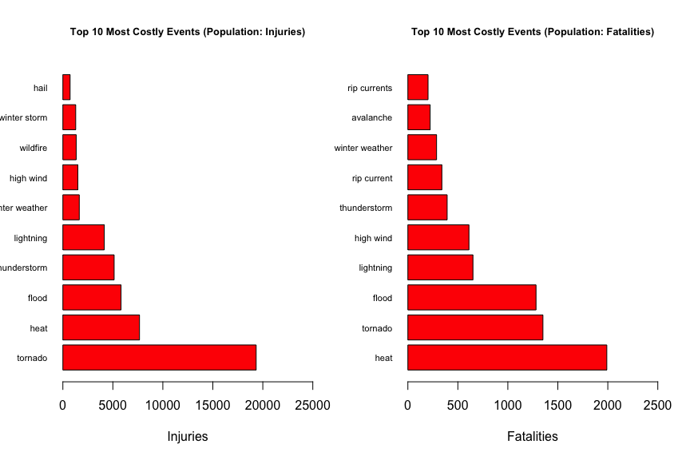
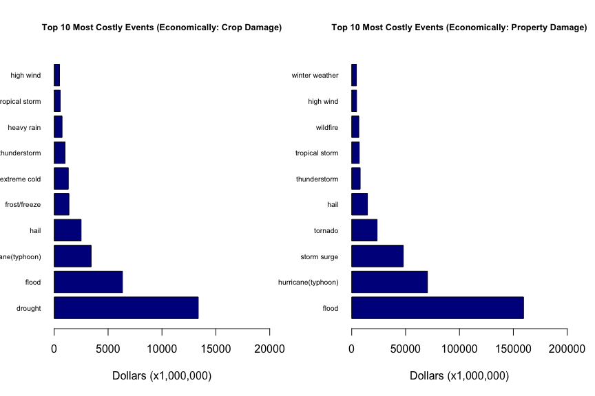
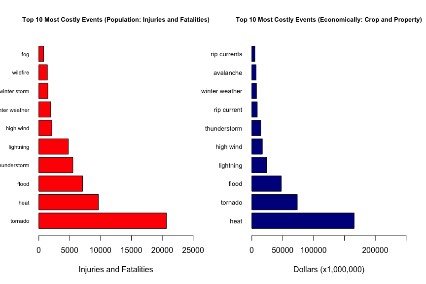

# Peer Assignment 2
Ahmed Tadde  
June 18, 2015  

##Synopsis

The U.S. National Oceanic and Atmospheric Administration (NOAA) maintains a database that tracks weather events in the United States. The data used for this analysis was collected from 1950 to 2011. The goal of the ensuing analysis is to:

   1. Determine the types of events (as indicated in the EVTYPE variable) that are most harmful with respect to population health(injuries and fatalities).
   2. Determine the types of events that have the greatest economic consequences( Crop and property Damage).

 

##Data Processing[Code Section]

   - Libraries
   - Loading the Data
   - Tidying the Data

###Libraries

```r
library(data.table)
library(dplyr)
```

```
## 
## Attaching package: 'dplyr'
## 
## The following objects are masked from 'package:data.table':
## 
##     between, last
## 
## The following object is masked from 'package:stats':
## 
##     filter
## 
## The following objects are masked from 'package:base':
## 
##     intersect, setdiff, setequal, union
```


###Loading the Data

```r
link <- "https://d396qusza40orc.cloudfront.net/repdata%2Fdata%2FStormData.csv.bz2"
location.name <- "repdata-data-StormData.csv.bz2"
if (!file.exists("repdata-data-StormData.csv.bz2")) {
    download.file(link, destfile = location.name, method = "auto")
}

Data <- read.table("repdata-data-StormData.csv.bz2", sep = ",", na.strings = "NA", 
    stringsAsFactors = F, header = T)

Data <- as.data.table(Data)

# =====================================================================================
# Inspecting the Data
dim(Data)
```

```
## [1] 902297     37
```

```r
str(Data)
```

```
## Classes 'data.table' and 'data.frame':	902297 obs. of  37 variables:
##  $ STATE__   : num  1 1 1 1 1 1 1 1 1 1 ...
##  $ BGN_DATE  : chr  "4/18/1950 0:00:00" "4/18/1950 0:00:00" "2/20/1951 0:00:00" "6/8/1951 0:00:00" ...
##  $ BGN_TIME  : chr  "0130" "0145" "1600" "0900" ...
##  $ TIME_ZONE : chr  "CST" "CST" "CST" "CST" ...
##  $ COUNTY    : num  97 3 57 89 43 77 9 123 125 57 ...
##  $ COUNTYNAME: chr  "MOBILE" "BALDWIN" "FAYETTE" "MADISON" ...
##  $ STATE     : chr  "AL" "AL" "AL" "AL" ...
##  $ EVTYPE    : chr  "TORNADO" "TORNADO" "TORNADO" "TORNADO" ...
##  $ BGN_RANGE : num  0 0 0 0 0 0 0 0 0 0 ...
##  $ BGN_AZI   : chr  "" "" "" "" ...
##  $ BGN_LOCATI: chr  "" "" "" "" ...
##  $ END_DATE  : chr  "" "" "" "" ...
##  $ END_TIME  : chr  "" "" "" "" ...
##  $ COUNTY_END: num  0 0 0 0 0 0 0 0 0 0 ...
##  $ COUNTYENDN: logi  NA NA NA NA NA NA ...
##  $ END_RANGE : num  0 0 0 0 0 0 0 0 0 0 ...
##  $ END_AZI   : chr  "" "" "" "" ...
##  $ END_LOCATI: chr  "" "" "" "" ...
##  $ LENGTH    : num  14 2 0.1 0 0 1.5 1.5 0 3.3 2.3 ...
##  $ WIDTH     : num  100 150 123 100 150 177 33 33 100 100 ...
##  $ F         : int  3 2 2 2 2 2 2 1 3 3 ...
##  $ MAG       : num  0 0 0 0 0 0 0 0 0 0 ...
##  $ FATALITIES: num  0 0 0 0 0 0 0 0 1 0 ...
##  $ INJURIES  : num  15 0 2 2 2 6 1 0 14 0 ...
##  $ PROPDMG   : num  25 2.5 25 2.5 2.5 2.5 2.5 2.5 25 25 ...
##  $ PROPDMGEXP: chr  "K" "K" "K" "K" ...
##  $ CROPDMG   : num  0 0 0 0 0 0 0 0 0 0 ...
##  $ CROPDMGEXP: chr  "" "" "" "" ...
##  $ WFO       : chr  "" "" "" "" ...
##  $ STATEOFFIC: chr  "" "" "" "" ...
##  $ ZONENAMES : chr  "" "" "" "" ...
##  $ LATITUDE  : num  3040 3042 3340 3458 3412 ...
##  $ LONGITUDE : num  8812 8755 8742 8626 8642 ...
##  $ LATITUDE_E: num  3051 0 0 0 0 ...
##  $ LONGITUDE_: num  8806 0 0 0 0 ...
##  $ REMARKS   : chr  "" "" "" "" ...
##  $ REFNUM    : num  1 2 3 4 5 6 7 8 9 10 ...
##  - attr(*, ".internal.selfref")=<externalptr>
```

```r
names(Data)
```

```
##  [1] "STATE__"    "BGN_DATE"   "BGN_TIME"   "TIME_ZONE"  "COUNTY"    
##  [6] "COUNTYNAME" "STATE"      "EVTYPE"     "BGN_RANGE"  "BGN_AZI"   
## [11] "BGN_LOCATI" "END_DATE"   "END_TIME"   "COUNTY_END" "COUNTYENDN"
## [16] "END_RANGE"  "END_AZI"    "END_LOCATI" "LENGTH"     "WIDTH"     
## [21] "F"          "MAG"        "FATALITIES" "INJURIES"   "PROPDMG"   
## [26] "PROPDMGEXP" "CROPDMG"    "CROPDMGEXP" "WFO"        "STATEOFFIC"
## [31] "ZONENAMES"  "LATITUDE"   "LONGITUDE"  "LATITUDE_E" "LONGITUDE_"
## [36] "REMARKS"    "REFNUM"
```


###Tidying the Data

```r
# =====================================================================================
# We can set some variables to numeric type for calculations later on
Data$FATALITIES <- as.numeric(Data$FATALITIES)
Data$INJURIES <- as.numeric(Data$INJURIES)
# Data$CROPDMG <- as.numeric(Data$CROPDMG) Data$PROPDMG <-
# as.numeric(Data$PROPDMG)


# =====================================================================================
# Setting the string characters in EVTYPE to lower cases for convenience
Data$EVTYPE <- with(Data, tolower(EVTYPE))


# =====================================================================================
# Recoding the Property damage variable based on a mapping method referenced
# from NOAA documentation
Data$PROPDMGEXP[Data$PROPDMGEXP %in% c("", "-", "?", "NA")] <- 0
Data$PROPDMGEXP[Data$PROPDMGEXP %in% c("+")] <- 1
Data$PROPDMGEXP[Data$PROPDMGEXP %in% c("0", "1", "2", "3", "4", "5", "6", "7", 
    "8", "9")] <- 10
Data$PROPDMGEXP[Data$PROPDMGEXP %in% c("H", "h")] <- 100
Data$PROPDMGEXP[Data$PROPDMGEXP %in% c("K", "k")] <- 1000
Data$PROPDMGEXP[Data$PROPDMGEXP %in% c("M", "m")] <- 1e+06
Data$PROPDMGEXP[Data$PROPDMGEXP %in% c("B", "b")] <- 1e+09
Data$PROPDMGEXP <- as.numeric(Data$PROPDMGEXP)


# =====================================================================================
# Recoding the Crop damage variable based on a mapping method referenced
# from NOAA documentation
Data$CROPDMGEXP[Data$CROPDMGEXP %in% c("", "-", "?", "NA")] <- 0
Data$CROPDMGEXP[Data$CROPDMGEXP %in% c("+")] <- 1
Data$CROPDMGEXP[Data$CROPDMGEXP %in% c("0", "1", "2", "3", "4", "5", "6", "7", 
    "8", "9")] <- 10
Data$CROPDMGEXP[Data$CROPDMGEXP %in% c("H", "h")] <- 100
Data$CROPDMGEXP[Data$CROPDMGEXP %in% c("K", "k")] <- 1000
Data$CROPDMGEXP[Data$CROPDMGEXP %in% c("M", "m")] <- 1e+06
Data$CROPDMGEXP[Data$CROPDMGEXP %in% c("B", "b")] <- 1e+09
Data$CROPDMGEXP <- as.numeric(Data$CROPDMGEXP)


# =====================================================================================
# To have observations with complete case (all 48 official weather event
# types), we filter the data to keep only the observations starting from
# 1996.
Data <- filter(Data, as.POSIXct(Data$BGN_DATE, format = "%m/%d/%Y") > as.POSIXct("12/31/1995", 
    format = "%m/%d/%Y"))


# =====================================================================================
# Only keeping the columns of interests
Data <- Data %>% select(c(8, 23:28))


# =====================================================================================
# Do not include 'summary' observations
Data <- Data[!(grepl("summary", Data$EVTYPE)), ]


# =====================================================================================
# Only keep events that created at least one type of damage.
Data <- Data %>% filter(!(FATALITIES > 0 & INJURIES > 0 & PROPDMG > 0 & CROPDMG > 
    0))


# =====================================================================================
# Create new variables to evaluate the harmful effect on the population
# (injuries+fatalities), the economic cost of crop/property damages(
# separately and together)
Data <- Data %>% mutate(POPULATION.HEALTH = FATALITIES + INJURIES, CROP.DAMAGE.COST = CROPDMG * 
    CROPDMGEXP, PROPERTY.DAMAGE.COST = PROPDMG * PROPDMGEXP, TOTAL.DAMAGE.COST = CROP.DAMAGE.COST + 
    PROPERTY.DAMAGE.COST)


# =====================================================================================
# Mapping __some__ unofficial event types to the 48 event types [time
# consuming]
Data$EVTYPE[grepl("tstm wind", Data$EVTYPE) | grepl("severe thunderstorm", Data$EVTYPE) | 
    grepl("severe thunderstorms", Data$EVTYPE) | grepl("thunderstorm", Data$EVTYPE) | 
    grepl("thunderstorms", Data$EVTYPE) | grepl("thunderstorm winds", Data$EVTYPE) | 
    grepl("thunderstorm wind", Data$EVTYPE)] <- "thunderstorm"


Data$EVTYPE[grepl("ice", Data$EVTYPE) | grepl("low temperature", Data$EVTYPE) | 
    grepl("cool", Data$EVTYPE) | grepl("icy road", Data$EVTYPE) | grepl("hypothermia/exposure", 
    Data$EVTYPE) | grepl("wintry mix", Data$EVTYPE) | grepl("snow", Data$EVTYPE) | 
    grepl("record low", Data$EVTYPE) | grepl("hypothermia", Data$EVTYPE) | grepl("record cold", 
    Data$EVTYPE) | grepl("record  cold", Data$EVTYPE) | grepl("winter weather/mix", 
    Data$EVTYPE) | grepl("winter weather mix", Data$EVTYPE)] <- "winter weather"

Data$EVTYPE[grepl("frost", Data$EVTYPE) | grepl("freeze", Data$EVTYPE)] <- "frost/freeze"
Data$EVTYPE[grepl("heat", Data$EVTYPE) | grepl("hot", Data$EVTYPE)] <- "heat"
Data$EVTYPE[grepl("freezing", Data$EVTYPE)] <- "freezing fog"
Data$EVTYPE[grepl("marine tstm wind", Data$EVTYPE)] <- "marine thunderstorm wind"
Data$EVTYPE[grepl("hurricane", Data$EVTYPE) | grepl("typhoon", Data$EVTYPE)] <- "hurricane(typhoon)"
Data$EVTYPE[grepl("tornado", Data$EVTYPE)] <- "tornado"
Data$EVTYPE[grepl("surf", Data$EVTYPE)] <- "high surf"
Data$EVTYPE[grepl("cold/wind chill", Data$EVTYPE)] <- "cold/wind chill"
Data$EVTYPE[grepl("cold wind chill", Data$EVTYPE)] <- "cold/wind chill"
Data$EVTYPE[grepl("extreme cold wind chill", Data$EVTYPE)] <- "extreme cold/wind chill"
Data$EVTYPE[grepl("extreme cold/wind chill", Data$EVTYPE)] <- "extreme cold/wind chill"
Data$EVTYPE[grepl("hail", Data$EVTYPE)] <- "hail"
Data$EVTYPE[grepl("high winds", Data$EVTYPE)] <- "high wind"
Data$EVTYPE[grepl("winds", Data$EVTYPE)] <- "high wind"
Data$EVTYPE[grepl("wind and wave", Data$EVTYPE)] <- "high wind"
Data$EVTYPE[grepl("wind", Data$EVTYPE)] <- "high wind"
Data$EVTYPE[grepl("wind damage", Data$EVTYPE)] <- "high wind"
Data$EVTYPE[grepl("whirl wind damage", Data$EVTYPE)] <- "high wind"
Data$EVTYPE[grepl("strong wind", Data$EVTYPE)] <- "high wind"
Data$EVTYPE[grepl("strong winds", Data$EVTYPE)] <- "high wind"
Data$EVTYPE[grepl("storm surge/tide", Data$EVTYPE)] <- "storm surge"
Data$EVTYPE[grepl("wild/forest", Data$EVTYPE)] <- "wildfire"
Data$EVTYPE[grepl("wild", Data$EVTYPE)] <- "wildfire"
Data$EVTYPE[grepl("fire", Data$EVTYPE)] <- "wildfire"
Data$EVTYPE[grepl("flood", Data$EVTYPE) | grepl("hightide", Data$EVTYPE) | grepl("high tide", 
    Data$EVTYPE) | grepl("urban sml stream fld", Data$EVTYPE) | grepl("urban/sml stream fld", 
    Data$EVTYPE)] <- "flood"


# =====================================================================================
# Making the EVTYPE variable to a factor variable to facilitate calculations
# in the Result session
Data$EVTYPE <- as.factor(Data$EVTYPE)
```


##Results

- __The top 10 most harmful event types with respect to Injuries and with respect to Fatalities__ 

With respect to Injuries,

```r
table1 <- Data[, .(INJURIES = sum(INJURIES, na.rm = T)), by = .(EVENT.TYPE = EVTYPE)] %>% 
    arrange(desc(INJURIES))

table1 <- head(table1, n = 10L)
table1
```

```
##         EVENT.TYPE INJURIES
##  1:        tornado    19335
##  2:           heat     7665
##  3:          flood     5819
##  4:   thunderstorm     5128
##  5:      lightning     4141
##  6: winter weather     1642
##  7:      high wind     1498
##  8:       wildfire     1334
##  9:   winter storm     1284
## 10:           hail      723
```


With respect to Fatalities,

```r
table2 <- Data[, .(FATALITIES = sum(FATALITIES, na.rm = T)), by = .(EVENT.TYPE = EVTYPE)] %>% 
    arrange(desc(FATALITIES))

table2 <- head(table2, n = 10L)
table2
```

```
##         EVENT.TYPE FATALITIES
##  1:           heat       1990
##  2:        tornado       1351
##  3:          flood       1282
##  4:      lightning        651
##  5:      high wind        611
##  6:   thunderstorm        393
##  7:    rip current        340
##  8: winter weather        287
##  9:      avalanche        223
## 10:   rip currents        202
```


Displaying both results,

```r
par(mfrow = c(1, 2))
barplot(table1[1:10, INJURIES], names.arg = table1[1:10, EVENT.TYPE], horiz = T, 
    col = "red", xlab = "Injuries", main = "Top 10 Most Costly Events (Population: Injuries)", 
    xlim = c(0, 25000), las = 1, cex.names = 0.7, cex.main = 0.8, cex.axis = 1)

barplot(table2[1:10, FATALITIES], names.arg = table2[1:10, EVENT.TYPE], horiz = T, 
    col = "red", xlab = "Fatalities", main = "Top 10 Most Costly Events (Population: Fatalities)", 
    xlim = c(0, 2500), las = 1, cex.names = 0.7, cex.main = 0.8, cex.axis = 1)
```

 


- __The top 10 most harmful event types with respect to Crop Damage and with respect to Property Damage__ 


With respect to Crop Damage,

```r
table3 <- Data[, .(CROP.DAMAGE.COST = sum(CROP.DAMAGE.COST, na.rm = T)/10^6), 
    by = .(EVENT.TYPE = EVTYPE)] %>% arrange(desc(CROP.DAMAGE.COST))
table3 <- head(table3, n = 10L)
table3
```

```
##             EVENT.TYPE CROP.DAMAGE.COST
##  1:            drought       13367.5660
##  2:              flood        6333.6477
##  3: hurricane(typhoon)        3428.1078
##  4:               hail        2496.8225
##  5:       frost/freeze        1368.7610
##  6:       extreme cold        1308.9730
##  7:       thunderstorm        1004.2896
##  8:         heavy rain         728.1698
##  9:     tropical storm         556.0210
## 10:          high wind         493.7448
```


With respect to Property Damage,

```r
table4 <- Data[, .(PROPERTY.DAMAGE.COST = sum(PROPERTY.DAMAGE.COST, na.rm = T)/10^6), 
    by = .(EVENT.TYPE = EVTYPE)] %>% arrange(desc(PROPERTY.DAMAGE.COST))
table4 <- head(table4, n = 10L)
table4
```

```
##             EVENT.TYPE PROPERTY.DAMAGE.COST
##  1:              flood           159470.110
##  2: hurricane(typhoon)            70278.639
##  3:        storm surge            47834.724
##  4:            tornado            23576.044
##  5:               hail            14595.237
##  6:       thunderstorm             7862.948
##  7:     tropical storm             7014.006
##  8:           wildfire             6595.329
##  9:          high wind             4495.284
## 10:     winter weather             4351.615
```


Displaying both results,

```r
par(mfrow = c(1, 2))
barplot(table3[1:10, CROP.DAMAGE.COST], names.arg = table3[1:10, EVENT.TYPE], 
    horiz = T, col = "dark blue", xlab = "Dollars (x1,000,000)", main = "Top 10 Most Costly Events (Economically: Crop Damage)", 
    xlim = c(0, 20000), las = 1, cex.names = 0.65, cex.main = 0.8, cex.axis = 1)

barplot(table4[1:10, PROPERTY.DAMAGE.COST], names.arg = table4[1:10, EVENT.TYPE], 
    horiz = T, col = "dark blue", xlab = "Dollars (x1,000,000)", main = "Top 10 Most Costly Events (Economically: Property Damage)", 
    xlim = c(0, 2e+05), las = 1, cex.names = 0.65, cex.main = 0.8, cex.axis = 1)
```

 


 -__The top 10 event types that are most harmful with respect to population health(injuries and fatalities) and economic consequences__


With respect to population health(injuries and fatalities),

```r
table5 <- Data[, .(POPULATION.HEALTH = sum(POPULATION.HEALTH, na.rm = T)), by = .(EVENT.TYPE = EVTYPE)] %>% 
    arrange(desc(POPULATION.HEALTH))
table5 <- head(table5, n = 10L)
table5
```

```
##         EVENT.TYPE POPULATION.HEALTH
##  1:        tornado             20686
##  2:           heat              9655
##  3:          flood              7101
##  4:   thunderstorm              5521
##  5:      lightning              4792
##  6:      high wind              2109
##  7: winter weather              1929
##  8:   winter storm              1471
##  9:       wildfire              1390
## 10:            fog               772
```


With respect to economic consequences,

```r
table6 <- Data[, .(TOTAL.DAMAGE.COST = sum(TOTAL.DAMAGE.COST, na.rm = T)/10^6), 
    by = .(EVENT.TYPE = EVTYPE)] %>% arrange(desc(TOTAL.DAMAGE.COST))
table6 <- head(table6, n = 10L)
table6
```

```
##             EVENT.TYPE TOTAL.DAMAGE.COST
##  1:              flood        165803.757
##  2: hurricane(typhoon)         73706.747
##  3:        storm surge         47835.579
##  4:            tornado         23816.549
##  5:               hail         17092.060
##  6:            drought         14413.667
##  7:       thunderstorm          8867.238
##  8:     tropical storm          7570.027
##  9:           wildfire          6922.435
## 10:          high wind          4989.029
```


Displaying both results,

```r
par(mfrow = c(1, 2))
barplot(table5[1:10, POPULATION.HEALTH], names.arg = table5[1:10, EVENT.TYPE], 
    horiz = T, col = "red", xlab = "Injuries and Fatalities", main = "Top 10 Most Costly Events (Population: Injuries and Fatalities)", 
    xlim = c(0, 25000), las = 1, cex.names = 0.7, cex.main = 0.8, cex.axis = 1)


barplot(table6[1:10, TOTAL.DAMAGE.COST], names.arg = table2[1:10, EVENT.TYPE], 
    horiz = T, col = "dark blue", xlab = "Dollars (x1,000,000)", main = "Top 10 Most Costly Events (Economically: Crop and Property)", 
    xlim = c(0, 250000), las = 1, cex.names = 0.8, cex.main = 0.8, cex.axis = 1)
```

 


##Conlcusion

- In no particular order, excessive heat, tornadoes, and floods are the three event types that cause the most damage in terms of population health and in terms economict cost.


##References

- [NOAA Documentation](https://www.ncdc.noaa.gov/stormevents/pd01016005curr.pdf)
- [The 48 official event types since 1996](http://www.ncdc.noaa.gov/stormevents/details.jsp)
